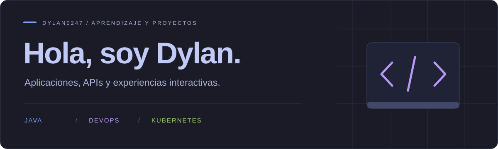

  <a href="https://github.com/Dylan0247?tab=repositories">Repositorios</a> &nbsp; · &nbsp;
  <a href="https://github.com/Dylan0247/frontend">AnimalGO · App</a> &nbsp; · &nbsp;
  <a href="https://github.com/Dylan0247/backend">AnimalGO · API</a>

## Sobre mí

Desarrollo aplicaciones y servicios backend. Mi proyecto destacado es **AnimalGO**, un RPG educativo sobre animales que une una experiencia de juego en Flutter con una API en Python.

Me interesa conectar la interfaz, la lógica de la aplicación y los datos para construir proyectos completos.

## Tecnologías

| Área | Tecnologías que utilizo en AnimalGO |
| :--- | :--- |
| Aplicación | **Dart · Flutter** |
| Juego | **Bonfire · Flame · Tiled** |
| Backend | **Python · FastAPI** |
| Datos y autenticación | **PostgreSQL · Supabase** |
| Integraciones | **Stripe** |

## Proyecto destacado

### AnimalGO
Un RPG educativo de animales, con una aplicación multiplataforma y servicios backend.

| Aplicación | API |
| :--- | :--- |
| Interfaz y experiencia de juego desarrolladas con Flutter, Bonfire y Flame. Mapas creados con Tiled. | API con FastAPI, autenticación, perfiles de jugadores y persistencia con Supabase y PostgreSQL. |
| Pruebas de navegación, servicios y componentes. | Pruebas de salud, autenticación y perfil. |
| [Explorar el frontend →](https://github.com/Dylan0247/frontend) | [Explorar el backend →](https://github.com/Dylan0247/backend) |

## Explora mi trabajo

El código, la documentación y las instrucciones para ejecutar AnimalGO están disponibles en los repositorios de la [aplicación](https://github.com/Dylan0247/frontend) y la [API](https://github.com/Dylan0247/backend).

Para conocer mi actividad, puedes consultar los repositorios y las contribuciones que aparecen en este perfil.

---

DYLAN0247 &nbsp; / &nbsp; Aplicaciones · Backend · Juegos educativos

