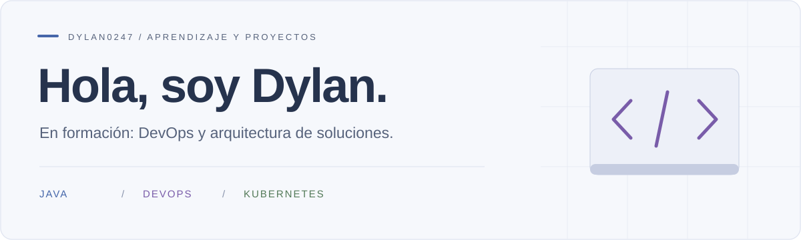

<picture>
  <source media="(prefers-color-scheme: dark)" srcset="assets/tokyo-night.svg">
  <source media="(prefers-color-scheme: light)" srcset="assets/tokyo-day.svg">
  
</picture>

  <a href="#sobre-mí">Sobre mí</a> &nbsp; · &nbsp;
  <a href="#mi-enfoque">Mi enfoque</a> &nbsp; · &nbsp;
  <a href="#proyecto-actual">Proyecto actual</a> &nbsp; · &nbsp;
  <a href="https://github.com/Dylan0247?tab=repositories">Repositorios</a>

## Sobre mí

Soy Dylan y estoy estudiando para orientar mi carrera hacia **DevOps y la arquitectura de soluciones**.

Tengo conocimientos de **Java** y actualmente estoy aprendiendo **Kubernetes**, mientras amplío mi formación en DevOps y diseño de soluciones.

## Mi enfoque

| Base actual | En aprendizaje | Objetivo profesional |
| :--- | :--- | :--- |
| **Java** | **Kubernetes · DevOps · Arquitectura de soluciones** | Trabajar en DevOps y evolucionar hacia arquitectura de soluciones. |

## Proyecto actual

### AnimalGO

Mi proyecto actual es un **RPG educativo sobre animales**. Me permite trabajar con una aplicación multiplataforma, una API y servicios de datos y autenticación.

| Componente | Tecnologías del proyecto | Código |
| :--- | :--- | :--- |
| Aplicación y juego | Dart · Flutter · Bonfire · Flame · Tiled | [Frontend →](https://github.com/Dylan0247/frontend) |
| API | Python · FastAPI | [Backend →](https://github.com/Dylan0247/backend) |
| Datos y autenticación | PostgreSQL · Supabase | Incluidos en la aplicación y la API |
| Integración de pagos | Stripe | Incluida en el proyecto |

Los repositorios incluyen documentación de arranque y pruebas de navegación, servicios, autenticación y perfiles.

## Mi trabajo

Puedes explorar mis [repositorios](https://github.com/Dylan0247?tab=repositories) y la actividad que aparece en este perfil para seguir mis proyectos y aprendizaje.

---

DYLAN0247 &nbsp; / &nbsp; Java · DevOps en formación · Arquitectura de soluciones

